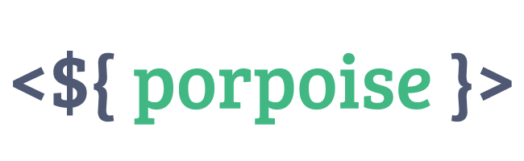

Lightning fast UIs on modern DOM APIs.

---

# Why Porpoise?

- Straightforward:
    - Built-in use in `.html` files (no HTML parsing, etc).
    - As little abstraction as possible: Just DOM APIs, with a touch of reactivity.
- Lightweight:
    - Takes advantage of native, fast DOM APIs, no reinventing the wheel.
        - **ES6 Proxies** for reactivity, which is faster and more user friendly than manually `get`/`set` handlers.
        - **Custom Elements v1** to provide a full DOM element with built-in lifecycle hooks (no need to rewrite those either).
    - **NO** Virtual DOM overhead. Porpoise stores update functions, which get triggered when a property is changed. There is no diffing or separate object tree involved.
- Easy to learn:
    - Get started with a simple CDN bundle and write your fast UIs in template backticks.
    - Advanced users can take advantage of tree-shaking and JSX to boost performance even more.


# Install:
NPM (recommended, both global & ESM): `npm i porpoise`

CDN:
- Global (recommended): https://cdn.jsdelivr.net/npm/porpoise@latest/lib/index.js
- ESM (only for in-browser testing): https://cdn.jsdelivr.net/npm/porpoise@latest/lib/esm/index.js

# The classic counter, in 5 steps:

### Initialize a component with the template compiler
```js
import { construct } from "porpoise";
construct("cool-counter", {
});
```

### Render the markup:
```js 
import { construct } from "porpoise";
construct("cool-counter", {

    template: `
        <h1>
            Count:
            <span />
        </h1>
        <button>Increase</button>
        <button>Decrease</button>
    `,
});
```

### Setup the `count` property
```js 
import { construct } from "porpoise";
construct("cool-counter", {
    template: `
        <h1>
            Count:
            <span :p-text="this.props.count" />
        </h1>
        <button>Increase</button>
        <button>Decrease</button>
    `,

    castedProps: { count: "number" } // Auto-casts the attribute "count" to a number.
});
```

### Create and bind event listeners
```js
import { construct } from "porpoise";
construct("cool-counter", {
    template: `
        <h1>
            Count:
            <span :p-text="this.props.count" />
        </h1>
        <button @click="this.store.increase">Increase</button>
        <button @click="this.store.decrease">Decrease</button>
    `,

    castedProps: { count: "number" },

    // The store holds component-specific data:
    store() {
        return {
            increase() { this.props.count++; },
            decrease() { this.props.count--; }
        }
    },
});
```

### Voila! Now you're ready to use your element!

```html
<!-- In your HTML -->
<cool-counter count="1">
</cool-counter>
```
