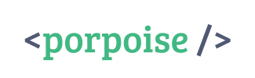

> ### A light, Vue-inspired abstraction layer over custom elements.

# Install:
`npm i porpoise`

# The classic counter, in 5 steps:

1. Initialize a component:
```js
import { construct, html } from "porpoise";
construct("cool-counter", {});
```

2. Render the markup:
```js 
import { construct, html } from "porpoise";
construct("cool-counter", {
    render() {
        return html`
            <h1>
                Count:
                <span />
            </h1>
            <button>Increase</button>
            <button>Decrease</button>
        `;
    }
});
```

3. Setup the `count` property:
```js 
import { construct, html } from "porpoise";
construct("cool-counter", {
    render() {
        return html`
            <h1>
                Count:
                <span innerText=${() => this.props.count} />
            </h1>
            <button>Increase</button>
            <button>Decrease</button>
        `;
    },

    castedProps: { count: "number" }
});
```

4. Create and bind event listeners:
```js
import { construct, html } from "porpoise";
construct("cool-counter", {
    store() {
        return {
            increase() { this.props.count++; },
            decrease() { this.props.count--; }
        }
    },

    render() {
        return html`
            <h1>
                Count:
                <span innerText=${() => this.props.count} />
            </h1>
            <button onClick=${this.store.increase}>Increase</button>
            <button onClick=${this.store.decrease}>Decrease</button>
        `;
    },

    castedProps: { count: "number" }
});
```

5. Voila! Now you're ready to use your element!

```html
<!-- In your HTML -->
<cool-counter count="1">
</cool-counter>
```